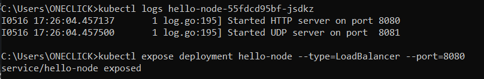
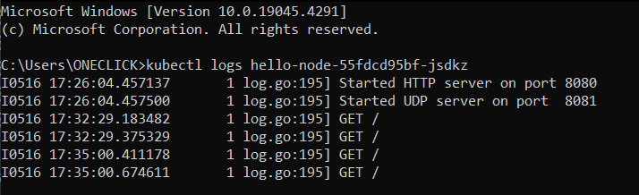

#### Nama : Muh. Kemal Lathif Galih Putra
#### NPM : 2206081225
#### Kelas : ADPRO - A
#### ASDOS : REN
# TUTORIAL - 11
## Refleksi MiniCube

1. Compare the application logs before and after you exposed it as a Service.
Try to open the app several times while the proxy into the Service is running.
What do you see in the logs? Does the number of logs increase each time you open the app?

Before Expose

After Expose

Ada perbedaan jumlah log antara sebelum dan sesudah aplikasi di-expose sebagai Service. Sebelum diekspos, aplikasi diakses langsung di dalam pod dan log mencatat pesan awal (Started HTTP server on port 8080 dan Started UDP server on port 8081).

Setelah aplikasi di-expose sebagai Service menggunakan perintah minikube service hello-node, log tetap mencatat pesan awal dan permintaan yang masuk, namun sekarang permintaan tersebut diteruskan melalui service yang memungkinkan akses eksternal ke aplikasi. Setiap kali aplikasi diakses atau di-refresh melalui browser, jumlah entri log bertambah karena browser mengirimkan GET request ke service. Ini terlihat pada gambar dengan waktu 06:43:46 untuk log pertama dan 06:59:27 untuk log kedua.

2. Notice that there are two versions of `kubectl get` invocation during this tutorial section.
The first does not have any option, while the latter has `-n` option with value set to
`kube-system`. What is the purpose of the `-n` option and why did the output not list the pods/services that you
explicitly created?

Jawaban:

Opsi -n pada perintah kubectl get memungkinkan kita untuk memilih namespace tertentu di Kubernetes. Ini sangat berguna jika ada banyak layanan dengan nama yang sama di berbagai namespace. Jika opsi -n tidak digunakan, kubectl get akan menampilkan sumber daya dari namespace default. Namespace digunakan untuk memisahkan sumber daya dalam cluster. Dengan menggunakan -n kube-system, kita dapat melihat sumber daya dari namespace yang berisi komponen inti Kubernetes, seperti DNS dan server API. Tanpa opsi -n, perintah tersebut akan menampilkan sumber daya yang secara eksplisit dibuat oleh pengguna.

## Refleksi Update & Kubernetes Manifest File

